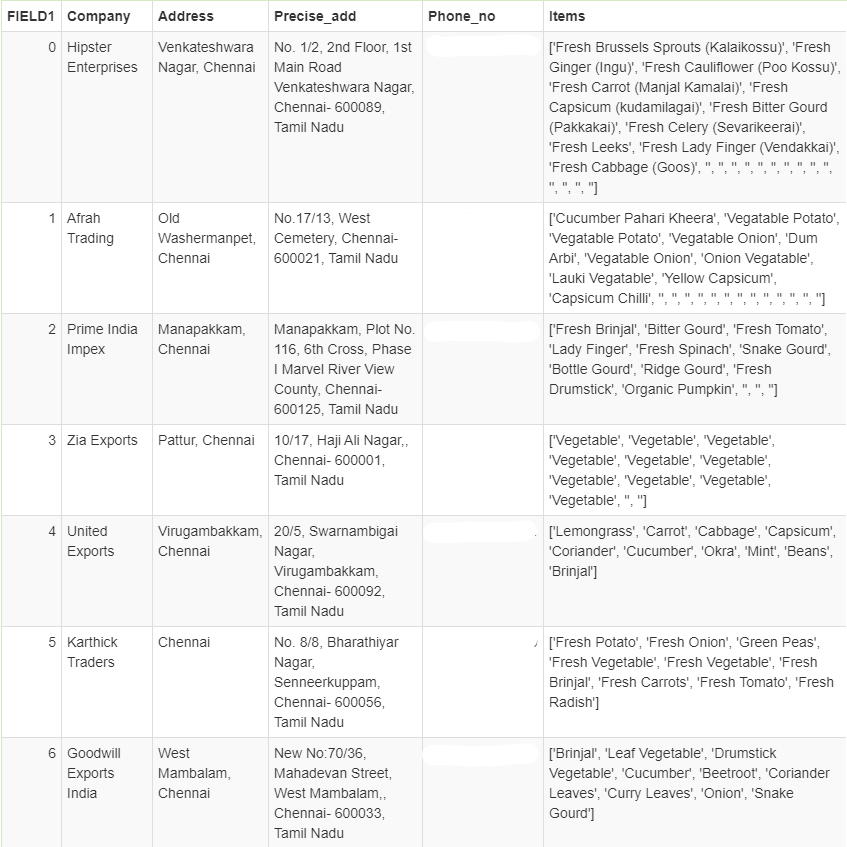

IndiaMart scraper
===================================

Scrapes the <b>supplier details (like Company name, Address, City, Phone no etc)</b> from the given link and generates .csv file for it.

## Packages/Tools used -
* [Selenium](https://pypi.org/project/selenium/)
* [ChromeDriver - WebDriver](https://chromedriver.chromium.org/) 

## How to use -
1. Install the required packages and tools.
2. Change the ChromeDriver path accordingly on line 8 in [indiamart_scrape](indiamart_scrape.py) python file.
3. Change the url with the one required on line 10 in [indiamart_scrape](indiamart_scrape.py) python file.
4. Run the python file.

### Screenshot -
  
  